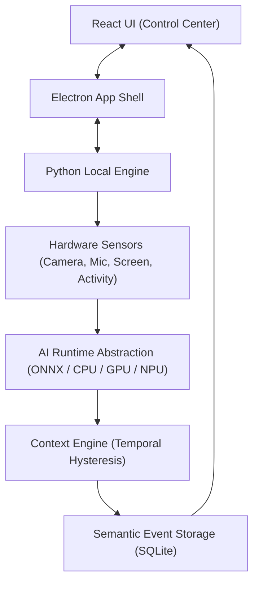

# EchoDesk

Privacy-First On-Device Context Engine


## Overview

**EchoDesk** is an enterprise-grade, privacy-first, on-device context engine and utility software for Windows desktop systems. Inspired by modern laptop control center applications (such as GIGABYTE Control Center), EchoDesk aggregates hardware telemetry, local sensor data, and dynamic operational states to synthesize real-time user context—without compromising user privacy or sending sensitive media outside the local machine.

---

## Features

EchoDesk includes all 42 core context management & system monitoring capabilities:

1. **System Dashboard**: High-density desktop control center inspired by laptop utility software.
2. **Context Core**: Dynamic tachometer speedometer dial gauge with mode color transitions.
3. **Current Context**: Real-time context state determination (`Deep Focus`, `Balanced`, `Collaboration`, `Meeting`, `Private`).
4. **Context Confidence**: Quantitative metric indicating context accuracy and sensor alignment.
5. **Context Modes**: Instant context profile switching with automatic hardware & privacy tuning.
6. **Camera Status**: Hardware status and active access indicator for optical sensors.
7. **Microphone Status**: Audio input monitoring and decibel telemetry.
8. **Screen/Application Status**: Active window title & application process detection.
9. **Activity Status**: Keyboard & mouse idle detection using native Windows API telemetry.
10. **CPU Telemetry**: Core usage, frequency, and load distribution monitoring.
11. **GPU Telemetry**: GPU utilization and VRAM allocation.
12. **RAM Telemetry**: Memory consumption and system buffer tracking.
13. **Storage Telemetry**: Storage volume read/write telemetry and capacity usage.
14. **Battery Telemetry**: Power source, charge percentage, and estimated runtime remaining.
15. **Temperature Telemetry**: Thermal zone sensors and thermal throttling status.
16. **Fan Information**: Dual fan tachometer speeds (CPU Fan & GPU Fan RPM).
17. **AI Runtime Status**: On-device execution provider status (`Intel CPU`, `NVIDIA GPU`, `Snapdragon NPU`).
18. **NPU/CPU Runtime State**: Real-time accelerator provider state and hardware tier detection.
19. **Inference Latency**: Sub-millisecond context inference latency benchmarking.
20. **Context Signals**: Raw telemetry feature streams feeding into the context engine.
21. **Privacy Status**: Master privacy system status and active protection level.
22. **Private Mode**: Hardware kill-switch that instantly suspends all camera, mic, and screen sensing.
23. **Pause Sensing**: Timed suppression intervals (15m, 1h, 2h) for temporary privacy.
24. **Protected Applications**: List of sensitive apps (banking, credential managers) that trigger automatic sensing pause when focused.
25. **Privacy Pipeline**: Local data isolation pipeline guaranteeing zero raw media persistence.
26. **Data Retention**: Configurable log retention policies for local semantic events.
27. **Context Timeline**: Interactive chronological log of context shifts and semantic events.
28. **Timeline Filters**: Search and filter events by category, confidence, and timestamp.
29. **Timeline Event Details**: Deep-dive inspector for event metadata and raw signal metrics.
30. **Sensors Page**: Hardware sensor configuration, frame rate tuning, and sensitivity controls.
31. **Camera Controls**: Resolution, sampling frequency, and face detection toggles.
32. **Microphone Controls**: Noise threshold, decibel sampling, and audio activity meters.
33. **Screen Context Controls**: Window title sampling rate and application categorizer options.
34. **Activity Controls**: Mouse/keyboard inactivity threshold sliders.
35. **AI Runtime/Performance Page**: Hardware acceleration benchmarks, provider selector, and latency graphs.
36. **Performance Graphs**: Real-time telemetry timelines for system load and context transitions.
37. **Background-Running Status**: Low-overhead tray service status and system resource consumption.
38. **System-Tray-Style Controls**: Minimize-to-tray, quick private mode toggle, and notification menu.
39. **AI Sampling Controls**: Telemetry sampling interval controls (100ms - 5000ms).
40. **Context Sensitivity**: Threshold tuning for context state transition triggers.
41. **Settings**: Application preferences, start-with-Windows toggles, and appearance settings.
42. **Development/Simulation Mode**: Fallback hardware simulator for testing on non-target environments.

---

## How It Works

```text
Sensors (Camera, Mic, Screen, Activity)
  ↓
Local Processing (Feature Extraction & Anonymization)
  ↓
Semantic Events (Structured Signal Abstractions)
  ↓
Context Engine (Temporal Hysteresis & State Classifier)
  ↓
Control Center (Interactive Laptop Utility UI)
```

---

## Privacy

EchoDesk is built from the ground up with a strict **Local-First, Zero-Trust Privacy Guarantee**:

- **Local-First Architecture**: All sensor ingestion, context calculation, and database storage take place exclusively on your local machine. No external servers or API endpoints are contacted.
- **Raw Media Handling**: Video frames and audio buffers are processed entirely in volatile memory (RAM) and immediately discarded. **Raw audio or video is never saved to disk**.
- **Private Mode**: Engaging Private Mode instantly disables all camera, microphone, and screen listeners at the hardware adapter level.
- **Protected Applications**: When a user switches to a flagged sensitive application (e.g. Password Manager, Banking Browser Window), EchoDesk automatically pauses sensing until the application loses focus.
- **Semantic Event Storage**: Only high-level abstract events (e.g. `User Focus high`, `App category: IDE`) are stored in an encrypted local SQLite database (`echodesk.db`).

---

## Architecture



---

## Windows Installation

### Download EchoDesk for Windows

Get the latest Windows desktop release build:

- **[Download EchoDesk for Windows](https://github.com/Anik-da/EchoDesk/releases/latest)**

### Latest Release

- **[Download the latest version (v1.0.0)](https://github.com/Anik-da/EchoDesk/releases/tag/v1.0.0)**

---

## Installation

1. Download `EchoDesk-Windows-v1.0.0.zip` or `EchoDesk.exe` from the [Latest Release](https://github.com/Anik-da/EchoDesk/releases/latest).
2. Extract the ZIP package into a local directory (e.g., `C:\Program Files\EchoDesk` or `C:\Users\<User>\AppData\Local\EchoDesk`).
3. Run `EchoDesk.exe` to launch the standalone desktop application.
4. EchoDesk will initialize the low-overhead background engine and open the Control Center dashboard.

---

## Development Machine

The current primary development and testing environment is a **GIGABYTE G6** laptop:

- **OS**: Windows 11 Home / Pro (x64)
- **CPU**: Intel Core processor
- **GPU**: NVIDIA GeForce RTX Laptop GPU
- **NPU**: *Not present on standard x86 GIGABYTE G6 hardware*

> **Note**: On the GIGABYTE G6 development machine, EchoDesk correctly detects the system configuration and operates in **x86 CPU/GPU Execution Provider Mode**. It does **not** falsely claim Snapdragon NPU availability.

---

## Snapdragon / Qualcomm Acceleration

EchoDesk features a modular AI Runtime Abstraction Layer designed for next-generation Copilot+ PCs powered by **Qualcomm Snapdragon X Elite / Plus** processors:

- When executed on a Snapdragon device with Qualcomm Neural Processing SDK (QNN) drivers installed, EchoDesk automatically selects the **Hexagon NPU** execution provider for hardware-accelerated, ultra-low-power context inference.
- On standard x86 Intel/AMD machines (such as the GIGABYTE G6), EchoDesk gracefully falls back to **CPU/CUDA acceleration** while clearly displaying `Snapdragon NPU: Not available` in the system telemetry panel.

---

## Development

To run EchoDesk locally in development mode:

### Prerequisites

- Node.js (v18+)
- Python 3.10+
- `pip install opencv-python numpy psutil pillow pywin32`

### Setup & Run

1. Clone the repository:
   ```bash
   git clone https://github.com/Anik-da/EchoDesk.git
   cd EchoDesk
   ```

2. Install dependencies:
   ```bash
   npm install
   ```

3. Start the background Python engine & Vite dev server:
   ```bash
   npm run dev:all
   ```

4. Launch the Electron desktop shell:
   ```bash
   npm run electron:start
   ```

---

## License

MIT License. Designed & developed as a privacy-first context engine.
